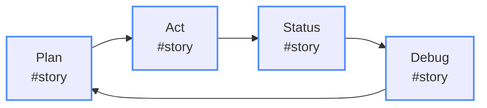

# ngLibrary Feature Development Challenge

## 🎯 Challenge Overview

Your mission is to **design and document a new feature** for the ngLibrary reference application. This challenge will teach you how to write comprehensive feature requirements that integrate seamlessly with the ConPort workflow and architectural patterns we've created.

## 📋 What You'll Learn

- How to analyze existing architecture before proposing new features
- Writing clear, actionable feature requirements
- Documenting technical decisions and trade-offs
- Creating implementation roadmaps that align with microservices patterns
- Using ConPort to track feature development progress

## 🏗️ Architecture Context

Before you begin, familiarize yourself with the existing ngLibrary architecture by reviewing:

- **Architecture Diagrams**: `architectureDiagrams/*.md` - Architecture documentation created by GitHub Copilot
- **Current Modules**: App, Books, Cart, Checkout, Layouts, Core
- **Technology Stack**: Typescript 4, Angular 11

## 🎲 Feature Ideas (Choose One or Create Your Own)

### 💡 **Beginner Level**
- **Book Reviews & Ratings**: Allow customers to review and rate books
- **Wishlist Management**: Save books for later checkout
- **Book Recommendations**: "Customers who read this book this also read..."

### 🔥 **Intermediate Level**
- **Inventory Management**: Real-time stock tracking with low-stock alerts
- **Advanced Search**: Faceted search with filters, sorting, and autocomplete
- **Loyalty Program**: Points-based rewards system with tier benefits

### 🚀 **Advanced Level**
- **Real-time Notifications**: WebSocket-based book availability updates

### 🎨 **Your Own Idea**
Create something unique that fits the library management domain and showcases modern software engineering practices.

## 📝 Requirements Template

Create a new markdown file named `feature-[your-feature-name].md` in a directory named `/backlog`. Here's a sample structure that can help! (also, see our example feature in the `exercise-files` folder!):

```markdown
# Feature: [Your Feature Name]

## 📖 Executive Summary

### Business Value
- [ ] **Problem Statement**: What business problem does this solve?
- [ ] **Target Users**: Who will use this feature?
- [ ] **Success Metrics**: How will you measure success?
- [ ] **Business Impact**: Revenue, user engagement, operational efficiency?

### Technical Alignment
- [ ] **Architecture Fit**: How does this align with the microservices architecture?
- [ ] **Service Boundaries**: Which services will be affected or created?
- [ ] **Data Ownership**: Which service owns the feature's data?

## 🎯 Feature Requirements

### Functional Requirements
1. **[Requirement ID]**: [Clear, testable requirement]
   - **Acceptance Criteria**: 
     - Given [context]
     - When [action]
     - Then [expected outcome]
   - **Priority**: Must Have / Should Have / Could Have / Won't Have

2. **[Next Requirement]**...

### Non-Functional Requirements
- **Performance**: Response time, throughput expectations
- **Scalability**: Expected load, growth patterns
- **Security**: Authentication, authorization, data protection
- **Reliability**: Availability, error handling, recovery
- **Usability**: User experience considerations

## 🏗️ Technical Design

### Service Architecture
- **New Services**: What new microservices need to be created?
- **Modified Services**: Which existing services need changes?
- **Service Communication**: How will services communicate? (sync/async)
- **Data Flow**: Map the data flow through your feature

### Database Design
- **New Tables/Collections**: Schema design
- **Data Relationships**: How does your data relate to existing entities?
- **Migration Strategy**: How will you handle schema changes?

### Event Design
- **Domain Events**: What events will your feature publish?
- **Integration Events**: How will you integrate with other services?
- **Event Handlers**: What background processing is needed?

### API Design

# Example API endpoints

GET /api/[service]/[resource]
POST /api/[service]/[resource]
PUT /api/[service]/[resource]/{id}
DELETE /api/[service]/[resource]/{id}

## 🔄 Implementation Roadmap

### Phase 1: Foundation (Week 1-2)
- [ ] Service scaffolding
- [ ] Database schema
- [ ] Basic CRUD operations

### Phase 2: Core Features (Week 3-4)
- [ ] Business logic implementation
- [ ] Event integration
- [ ] API development

### Phase 3: Integration (Week 5-6)
- [ ] Frontend integration
- [ ] Service communication
- [ ] End-to-end testing

### Phase 4: Polish (Week 7-8)
- [ ] Performance optimization
- [ ] Security hardening
- [ ] Documentation

## 🧪 Testing Strategy

### Unit Testing
- [ ] Service layer tests
- [ ] Domain logic tests
- [ ] Repository tests

### Integration Testing
- [ ] API endpoint tests
- [ ] Database integration tests
- [ ] Event handler tests

### End-to-End Testing
- [ ] User workflow tests
- [ ] Cross-service integration tests
- [ ] Performance tests

## 📊 Monitoring & Observability

### Metrics
- [ ] Business metrics to track
- [ ] Technical metrics to monitor
- [ ] SLA/SLO definitions

### Logging
- [ ] Structured logging requirements
- [ ] Log correlation across services
- [ ] Security audit logging

### Alerting
- [ ] Critical alerts
- [ ] Performance degradation alerts
- [ ] Business metric alerts

## 🚨 Risk Assessment

### Technical Risks
- **Risk**: [Description]
  - **Probability**: High/Medium/Low
  - **Impact**: High/Medium/Low
  - **Mitigation**: [Strategy]

### Business Risks
- **Risk**: [Description]
  - **Mitigation**: [Strategy]

## 🎓 Decision Log

Use this section to document key decisions made during feature design:

### Decision 1: [Title]
- **Context**: Why was this decision needed?
- **Options Considered**: What alternatives were evaluated?
- **Decision**: What was chosen?
- **Rationale**: Why was this the best choice?
- **Consequences**: What are the implications?

## 📚 References

- [ ] External APIs or services referenced
- [ ] Design patterns used
- [ ] Industry best practices followed
- [ ] Performance benchmarks
```

## ✅ Success Criteria

Your feature requirements document should demonstrate:

### 📋 **Requirements Quality**
- [ ] **Clear Problem Definition**: Business need is well-articulated
- [ ] **Testable Acceptance Criteria**: Each requirement can be verified
- [ ] **Complete User Workflows**: End-to-end scenarios are covered
- [ ] **Edge Cases Considered**: Error conditions and failure modes addressed

### 🏗️ **Technical Soundness**
- [ ] **Architectural Alignment**: Fits existing microservices patterns
- [ ] **Service Boundaries**: Clear ownership and responsibilities
- [ ] **Data Consistency**: ACID vs eventual consistency choices justified
- [ ] **Event Design**: Proper domain and integration events identified

### 🔄 **Implementation Realism**
- [ ] **Incremental Delivery**: Broken into deliverable phases
- [ ] **Risk Mitigation**: Known risks identified with mitigation strategies
- [ ] **Testing Strategy**: Comprehensive testing approach outlined
- [ ] **Rollback Plan**: Deployment and rollback strategy considered

### 📈 **Business Value**
- [ ] **Measurable Outcomes**: Success metrics clearly defined
- [ ] **User Impact**: Benefits to different user types identified
- [ ] **Competitive Advantage**: How this differentiates the product
- [ ] **Technical Debt**: Impact on system maintainability considered

## 🚀 Getting Started

1. **Analyze the Architecture**: Spend time understanding the existing system
2. **Choose Your Feature**: Pick something that excites you and fits the domain
3. **Start with Why**: Begin with the business problem and user needs
4. **Design Incrementally**: Build complexity gradually
5. **Think Operations**: Consider monitoring, deployment, and maintenance
6. **Document Decisions**: Use ConPort to track your reasoning

## 💡 Pro Tips

### 🎯 **Requirements Writing**
- **Use Active Voice**: "The system shall..." not "The system should probably..."
- **Be Specific**: "Load in under 200ms" not "Load quickly"
- **Include Examples**: Show concrete scenarios
- **Consider Edge Cases**: What happens when things go wrong?

### 🏗️ **Architecture Decisions**
- **Follow Existing Patterns**: Don't reinvent what's working
- **Design for Failure**: What happens when dependencies fail?

## 🎉 Ready to Begin?

Remember: **Good requirements are the foundation of great software**. Take your time to think through the problem space before jumping into solutions. The ngLibrary application is a reference for modern software engineering practices—your feature should exemplify the same level of thoughtfulness and technical excellence.

**Start by creating your feature file and begin documenting your thinking process. Use Chat mode to help you if you're stuck!**

When you're created your requirements file, prompt Copilot in Agent Mode:

`Plan #feature-[your-feature-name].md`

This should trigger the planning process. The AI should validate and produce an implementation plan, and ask if you're ready to start! When you're ready to continue:

`Act: #feature-[your-feature-name].md`

From here, the AI will begin implementing your feature. Ensure you interact with the AI often, running unit tests, building and validating it's progress, provide feedback. Continue to use this process as you go until your feature is completed!


---

*This challenge is designed to simulate real-world feature development while teaching best practices for requirements documentation and architectural thinking. Focus on quality over speed—the goal is learning, not just completion.*

## Tips & Tricks
Check out the [Tips & Tricks](../3-tips.md) for a collection of common challenges and solutions we've faced and solved ourselves using this framework!